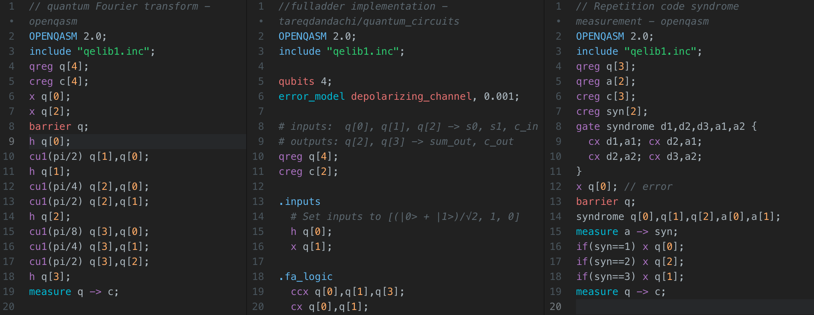

# QASM language support in Atom
Syntax highlighting for QASM code in Atom.

<!--  -->

Adds syntax highlighting and snippets to QASM files in Atom.

 

 

### Contributions
Contributions are greatly appreciated. Please fork this repository and open a pull request to add snippets, make grammar tweaks, etc.
